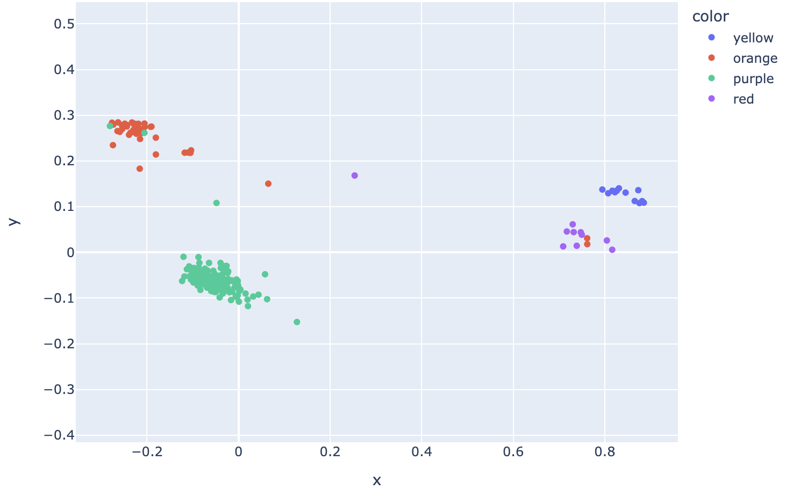
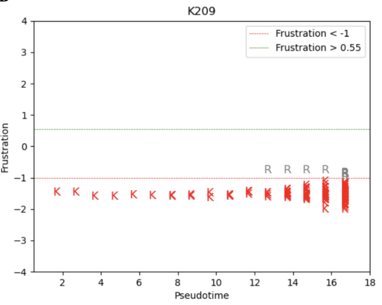
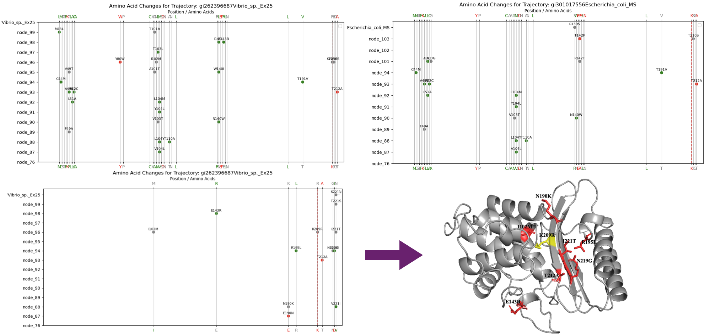

# Generate Sequence Embeddings
Repository created for projects done at BSC 2023/24

-> In the directory /ProstT5 a python script for creating sequence embeddings "generate_emb.py" can be found. It is used to create sequence embeddings based on a multifasta imput file. The input file has to be in csv format and contain a header with EntryID and Sequence as columns at least. It can also contain other columns, if needed. The example csv file can be found at /Train/all_globins.csv. Along with this file, the original multifasta file with globin sequences is also provided, along with an additional python script "csv_generate.py" which is used to convert multifasta file to csv format. 

-> Embeddings script asks for the input path and it generates two output files which paths are to be modified inside of the script:

train_data_path = 'Train/input.csv'  
embeddings_file = 'Train/embeddings.npy'  
uniprot_ids_file = 'Train/uniprot_ids_pairs.csv'  

-> The commandline for the script execution is: 

$ python generate_emb.py 

-> Once the output embeddings file "embeddings.npy" is created, in the same directory you can find a python notebook file "emb_plotting.ipynb" which is used to visualize the embeddings. Mofifications can be made in the code in order to color the embeddings differently. In the given example, they are colored based on their IDs in order to differentiate between different globin groups. The plot is interactive.

-> Plotting the reduced embeddings should output a similar plot as this one:

Script (prostT5) reference:
ProstT5: Bilingual Language Model for Protein Sequence and Structure
Michael Heinzinger, Konstantin Weissenow, Joaquin Gomez Sanchez, Adrian Henkel, Martin Steinegger, Burkhard Rost
bioRxiv 2023.07.23.550085; doi: https://doi.org/10.1101/2023.07.23.550085

# Time-dependent Energetic Frustration Plots

The frustration index, FI, allows one to localize and quantify local energetic frustration in protein structures. For single residues, a single residue frustration index (SRFI) is obtained. SRFI (single-residue frustration index) was plotted as a function of pseudotime that was derived based on the phylogenetic tree, for each amino acid of the reference sequence. On the y-axis local energetic frustration index (FI) was placed, while the x-axis is representative of pseudotime. To obtain pseudotime for the generated plots, each node of the phylogenetic tree was assigned a time value starting from 1 for the first common ancestor of lactamases (node 76) up to 16 for lactamases that correspond to leaves of the phylogenetic tree. This pseudotime metric represents the depth of the phylogenetic tree and it is described as the total number of edges from the root node (first common ancestor) to the reference node. This way, across the whole phylogenetic tree there are 16 timestamps in total. For the purpose of deriving a depth metric, a script in python that takes as the input a phylogenetic tree and outputs a csv file with protein names and depth header columns was written and it is provided as a supplementary material (readtree.py).

Below is the example of a plot:

# Frustration Changes / Amino Acid Substitution Plots

To generate (frustration) and amino acid substitution plots execute main.py script in the ./AA_Sub directory. Plots can show amino acid substitutions of catalytic or any other protein sequence sites. These have to be types inside of the main.py script at:
   specified_position = [c]
  additional_positions = [a,b,c,d,e] where specified position HAS TO be included in the additional positions!

Specified position is represented with a dashed line and all other additional substitutions are colored based on the new aquired frustrational state (green - minimally frustrated, grey - neutral, red - highly frustrated). On the lower x-axis amino acid of the first common ancestors are showed, while on the top x-axis amino acids of the trajectory protein (a protein whose changes in the trajectory the plot is showing) and they are all colored by their frustation state. This way we present the initial frustration state, as well as the final one. The last common ancestor sequence has to be stated in the main.py script as its FASTA ID at:

$   specified_position_fst_state = fst_states.get(('node_76', specified_position[0]), None)
$   node76_fst_state = fst_states.get(('node_76', additional_positions[0]), None)

$   node76_fst_state = fst_states.get(('node_76', pos), None)

$   node_76_aa_sequence = sequences.get('node_76')

Comparisons are made in pairs starting from the first common ancestor and the next protein sequence in the tajectory. 

-> from the paper: "Fig. 3. Time-dependent frustration and amino acid substitution trajectory plots. A) Vibrio Ex25 amino acid substitution trajectory plot. The plot shows amino acid substitutions of catalytic and surrounding residues that occurred in the Vibrio Ex25 trajectory where the residue of interest (substitution K209R) is represented with a dashed line and all substitutions are colored based on the new frustrational state (green - minimally frustrated, grAy - neutral, red - highly frustrated). B) E. Coli amino acid substitution trajectory plot. When comparing Vibrio and E. Coli trajectories, we observe a region around catalytic S130(105) with no amino acid changes in the Vibrio trajectory and a couple of changes in E. Coli trajectory. C) Vibrio Ex25 amino acid substitution plot where the residue of interest is represented with a dashed line (K209R). All showed substitutions are in mutational contact with the catalytic site K209, based on the output results from FrustraEvo. Substitutions are colored based on the new frustrational state. D) 1BTL lactamase reference structure with the catalytic K209 residue colored in yellow and contact residues colored in red. All residues seem to be close to one another in space."
